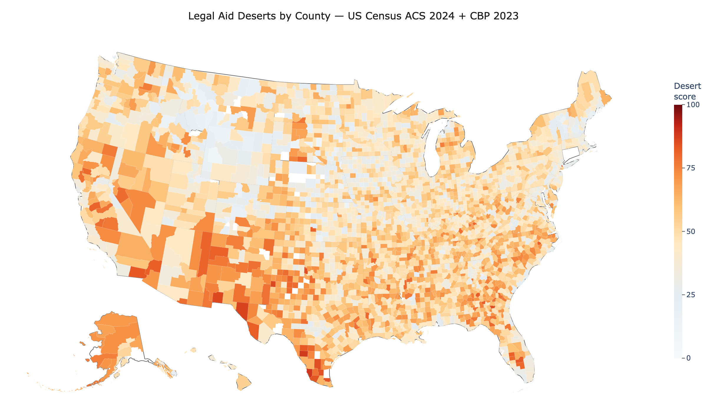

# Access to Justice Analytics

A Python and SQL analytics tool that identifies **legal aid deserts** across all
50 states and DC by cross-referencing socioeconomic and demographic indicators
— poverty rate, median household income, unemployment, educational attainment,
limited English proficiency, and foreign-born population — against the actual
supply of legal services in each county.

The result is a 0–100 **desert score** for every US county, plus an interactive
dashboard that filters those results by any of **48 ethnic and national-origin
communities**. That gives legal service providers, bar associations, and
affinity legal organizations a data-driven way to direct pro bono outreach to
where general legal-aid need overlaps the community they serve.



## Branches

| Branch | Purpose |
|---|---|
| **`main`** | General-purpose. Every community is treated identically: the dropdown is alphabetical, and the dashboard opens on whichever community the data shows is most desert-exposed. |
| **`south-asian-focus`** | The same tool scoped to South Asian legal-aid outreach, for organizations like SABA-NA and SAAJCO. |

The two editions run identical code, the same database, and the same
methodology. They differ only in the `edition` block of `config.json` and the
README. Critically, **the desert score itself is community-agnostic** — it
measures county-level need and legal-services supply, neither of which varies by
population — so no edition can produce a different score for the same county.
Switching editions changes which community the dashboard opens on, nothing else.

```
git checkout south-asian-focus
```

## The dashboard

`docs/index.html` is a self-contained interactive page — open it by
double-clicking, no server needed. To publish it as a live link, go to
**Settings → Pages** and set Source to the `main` branch, `/docs` folder;
GitHub will then serve it at
`https://kavyaramkumar.github.io/Access-to-Justice-Analytics/`.

Five tabs:

| Tab | What it does |
|---|---|
| **Overview** | Headline numbers, the national county map, and the need-vs-supply scatter |
| **Explore the map** | Recolour the map by any of ten indicators (desert score, need, supply gap, poverty, income, unemployment, limited English, foreign-born, offices per capita, or a community's share of each county) and zoom to any state |
| **Communities** | Pick any of the 48 communities and see the counties where it faces the widest legal-aid gap, plus a ranking of which communities are most desert-exposed nationally |
| **County lookup** | Search and sort all 3,110 counties; filter to zero-provider counties or severe deserts |
| **How it works** | The methodology, plus live controls that **re-weight the model and recompute every score in the browser** |

The re-weighting is the part worth playing with. The score ships as 60% need /
40% supply gap, but you can slide that anywhere and switch individual
indicators off. It is genuinely informative: drop the two immigration-related
indicators and Appalachian Kentucky and the Mississippi Delta rise to the top,
while weighting supply alone surfaces Alabama's Black Belt. The rankings are not
an artifact of one arbitrary formula, and you can see how much they depend on it.

## Data sources (US Census Bureau APIs)

| Source | What it provides |
|---|---|
| ACS 5-Year Estimates, 2024 | County poverty, median income, unemployment, education, foreign-born population |
| ACS Subject Table S1602 | Percent of limited-English-speaking households per county |
| ACS B02015 / B02024 / B03001 / B02001 | The 48 communities: Asian groups, Middle Eastern and North African origins, Hispanic or Latino origins, and broad race categories |
| County Business Patterns, 2023 (NAICS 5411) | Legal-services establishments per county — the supply side |

## How the desert score works

Every indicator is converted to a national percentile rank in SQL, oriented so
higher always means more need (low income and low educational attainment
therefore rank high). Then:

- **need_index** — average of the six socioeconomic percentiles (0–100)
- **supply_gap_index** — percentile of how *few* legal-services establishments
  exist per 10,000 residents (0–100)
- **desert_score = (0.6 × need_index) + (0.4 × supply_gap_index)**

A county scoring 90 has more combined need and less legal-service coverage than
roughly 90% of US counties. Counties under 1,000 residents are excluded because
their survey estimates are too noisy to rank fairly.

Measuring supply is what turns "need" into "unmet need" — a wealthy county with
no lawyers and a poor county with fifty lawyers are not the same problem.
**667 counties, home to 5.2 million people, have no legal-services
establishment of any kind.**

The whole calculation lives in [sql/desert_scores.sql](sql/desert_scores.sql)
using window functions, and that query deliberately keeps all seven percentile
components in its output — which is what lets the dashboard re-weight
everything client-side without re-running the Python.

## What the data shows

Population-weighted across every county a community lives in, the communities
most exposed to legal aid deserts are American Indian / Alaska Native (48.1),
Dominican (46.9), Bangladeshi (46.3) and Mexican (46.0). Full ranking in
[outputs/community_desert_exposure.csv](outputs/community_desert_exposure.csv).

The most severe individual deserts cluster along the Texas–Mexico border, the
Mississippi Delta, Appalachian Kentucky and West Virginia, the Black Belt across
Alabama and Georgia, and tribal counties in the Dakotas, Arizona and New Mexico.

## Setup

1. Install the dependencies:
   ```
   pip install -r requirements.txt
   ```
2. Get a free Census API key at
   <https://api.census.gov/data/key_signup.html>
3. Copy `.env.example` to a new file named `.env` and paste your key in.

## Running it

```
python pull_census_data.py     # pull ~3,100 counties + 48 communities -> data/
python build_database.py       # build legal_aid.db, score every county -> outputs/
python build_dashboard.py      # build the interactive dashboard -> docs/index.html
```

Results land in `outputs/` as CSVs and in the `legal_aid.db` SQLite database.
Ready-made queries — top deserts, the worst desert each community faces, which
communities are most exposed, zero-provider counties, state summaries — are in
[sql/analysis_queries.sql](sql/analysis_queries.sql):

```
sqlite3 -header -column legal_aid.db < sql/analysis_queries.sql
```

## Database design

Three tables, built by [sql/schema.sql](sql/schema.sql):

- `county_indicators` — one row per county: the need indicators and the supply count
- `county_populations` — one row per county **per community** (~150,000 rows)
- `desert_scores` — the scored output, including each percentile component

Community population lives in its own table rather than as one column per
group, because the desert score does not depend on which community you are
looking at. The score is computed once, group-agnostic, and the dashboard JOINs
to `county_populations` to filter. Adding a community is a data change, not a
schema change.

## Adding or changing communities

Edit the `population_groups` list in `config.json` — each entry is a key, a
display label, a dropdown category, and the ACS variable codes to sum. All
groups are pulled in the same batched API calls, so adding one costs nothing at
runtime. Browse variable codes at
<https://api.census.gov/data/2024/acs/acs5/variables.html>, then re-run the
three scripts.

To change which community the dashboard opens on, set
`edition.default_community` in `config.json` to any group key, or to
`"most_exposed"` to let the build derive it from the data.

## Reading the numbers carefully

- Establishment counts cover **all** legal-services businesses, so they proxy
  total legal capacity rather than counting free or reduced-cost legal aid
  providers. A county with commercial firms but no legal aid office will look
  better served than it is.
- ACS figures are 5-year survey estimates with margins of error that widen in
  small counties.
- The Middle Eastern / North African and Pacific Islander tables count "groups
  tallied", so someone reporting two origins is counted in both and those
  totals can exceed a county's population.
- Because the need index includes limited-English and foreign-born share,
  counties with extreme poverty but few immigrants — many tribal counties, for
  example — score lower than their hardship alone would suggest. Oglala Lakota
  County, South Dakota has the highest poverty rate in the country (57.6%) and
  zero legal-services offices, yet scores 70.9 rather than near the top. The
  indicator toggles on the "How it works" tab exist partly so you can test this.
- A desert score is a prioritisation aid, not a measure of any individual's
  access to justice.

## Project structure

```
config.json               data years, edition settings, 48 community definitions
pull_census_data.py       step 1: pull county data from the Census APIs
build_database.py         step 2: load SQLite, score, export rankings
build_dashboard.py        step 3: build the interactive dashboard
sql/schema.sql            database schema
sql/desert_scores.sql     the desert-score methodology (all SQL)
sql/analysis_queries.sql  example analyses
docs/index.html           the interactive dashboard (GitHub Pages ready)
outputs/                  ranked scores + community exposure (committed)
data/                     raw pulled data and cached boundaries (generated)
```
